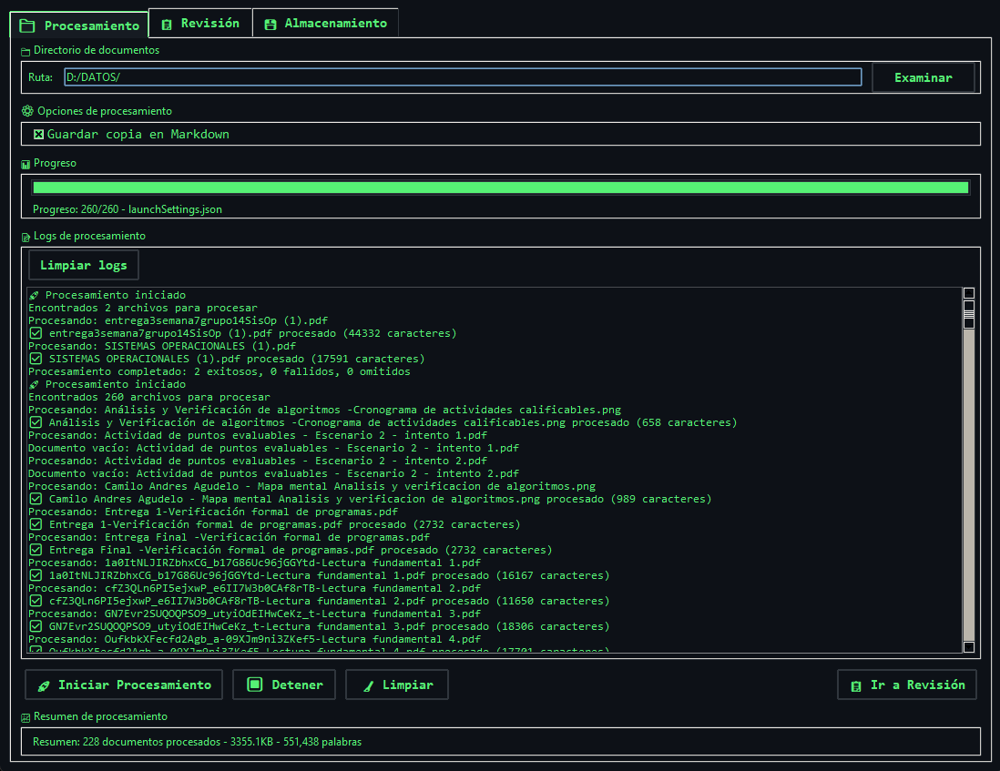
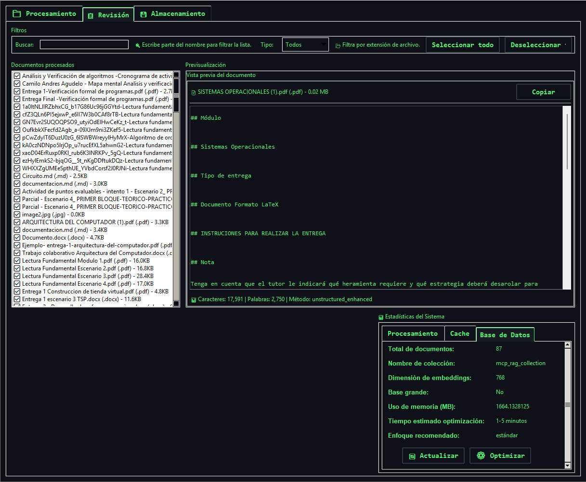
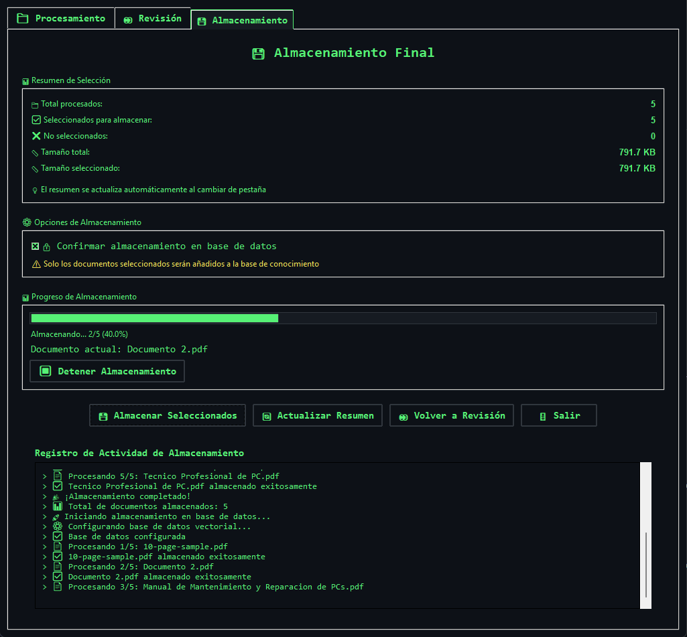
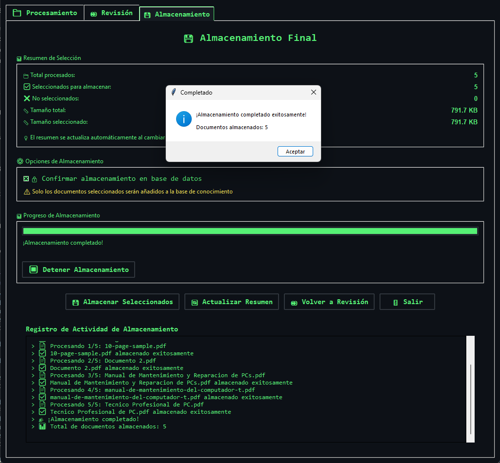

# 🚀 Bulk Ingest GUI Avanzado - Con Previsualización

## 🎯 ¿Qué es esta versión avanzada?

Esta es la **versión mejorada** de la aplicación GUI que incluye **previsualización de documentos** y **selección inteligente** antes de almacenar en la base de datos vectorial. Te permite:

- **👀 Ver el contenido** convertido a Markdown antes de almacenarlo
- **✅ Seleccionar qué documentos** quieres incluir en tu base de conocimiento
- **📊 Revisar la calidad** de la conversión
- **🎯 Tener control total** sobre qué se almacena

## 🌟 Características Principales

### 📋 **Interfaz con Pestañas**
- **📁 Procesamiento**: Configuración y procesamiento inicial
- **👀 Revisión**: Previsualización y selección de documentos
- **💾 Almacenamiento**: Almacenamiento final en la base de datos

### 👀 **Previsualización Avanzada**
- **Vista previa en Markdown** de cada documento
- **Información detallada** del archivo (tipo, tamaño, etc.)
- **Navegación fácil** entre documentos
- **Selección individual** de cada documento

### 🎯 **Control de Calidad**
- **Revisar conversiones** antes de almacenar
- **Detectar contenido irrelevante** o mal convertido
- **Seleccionar solo documentos útiles**
- **Evitar duplicados** o contenido de baja calidad

## 🛠️ Instalación y Uso

### Ejecutar la Aplicación Avanzada

#### Opción 1: Usando el archivo batch (Windows)
```bash
# Doble clic en:
run_gui_advanced.bat
```

#### Opción 2: Desde la línea de comandos
```bash
python bulk_ingest_gui_advanced.py
```

## 📖 Guía Visual Paso a Paso

Esta guía te llevará a través de cada pestaña de la aplicación para que saques el máximo provecho de la ingesta masiva de documentos.

### 🔄 **Paso 1: Pestaña de Procesamiento - Carga y Conversión**

Esta es la primera pantalla. Aquí es donde le dices a la aplicación qué documentos procesar.



1.  **Selecciona tu carpeta:** Usa el botón `Explorar...` para elegir el directorio que contiene tus documentos.
2.  **Configura las opciones:** Puedes decidir si quieres `Guardar copias en formato Markdown` para tener un respaldo del contenido convertido.
3.  **Inicia el Proceso:** Haz clic en `Iniciar Procesamiento`.
4.  **Monitorea el Progreso:** La barra de progreso te mostrará el estado y el `Registro de Actividad` te dará detalles de cada paso.
5.  **Avanza:** Una vez finalizado, haz clic en `Ir a Revisión` para continuar.

### 👀 **Paso 2: Pestaña de Revisión - Previsualiza y Selecciona**

En esta pestaña tienes el control total. Puedes ver qué se convirtió y decidir qué información es valiosa para tu base de conocimientos.



1.  **Explora los Documentos:** La lista de la izquierda (`Documentos Procesados`) muestra todos los archivos que se convirtieron a Markdown.
2.  **Previsualiza el Contenido:** Al hacer clic en un archivo de la lista, verás su contenido a la derecha, junto con detalles como su tipo y tamaño. Esto te permite verificar la calidad de la conversión.
3.  **Toma Decisiones:** Marca la casilla `Incluir en base de datos` para cada documento que quieras añadir.
4.  **Usa los Controles:** Para agilizar el trabajo, puedes usar `Seleccionar Todos` o `Deseleccionar Todos`. También puedes navegar entre documentos con los botones `Anterior` y `Siguiente`.

### 💾 **Paso 3: Pestaña de Almacenamiento - Confirma y Guarda**

Este es el último paso. Aquí confirmas tu selección y la guardas permanentemente en la base de datos vectorial para que la IA pueda usarla.



1.  **Verifica el Resumen:** El `Resumen de Selección` te muestra cuántos documentos vas a guardar y el tamaño total.
2.  **Confirma la Operación:** Es obligatorio activar la casilla `Confirmar almacenamiento en base de datos`. Esta es una medida de seguridad para evitar acciones accidentales.
3.  **Inicia el Almacenamiento:** Presiona `Almacenar Seleccionados`.
4.  **Observa el Progreso:** Al igual que en el procesamiento, una barra de progreso y un registro de actividad te mantendrán informado sobre qué documento se está guardando.



Una vez que el proceso termina, verás que la barra de progreso se completa y aparecerá un mensaje de confirmación. ¡Y listo! Tus conocimientos ahora forman parte de la memoria de tu IA.

## 🎯 Ventajas de la Versión Avanzada

### ✅ **Control de Calidad**
- **Revisar conversiones** antes de almacenar
- **Detectar problemas** en la conversión
- **Seleccionar solo contenido relevante**
- **Evitar contenido duplicado** o irrelevante

### 📊 **Mejor Organización**
- **Interfaz con pestañas** para mejor flujo de trabajo
- **Separación clara** entre procesamiento, revisión y almacenamiento
- **Navegación intuitiva** entre documentos
- **Información detallada** de cada archivo

### 🛡️ **Mayor Seguridad**
- **Confirmación explícita** antes de almacenar
- **Revisión manual** de cada documento
- **Control total** sobre el proceso
- **Logs detallados** de cada paso

## 🔍 Cómo Usar la Previsualización

### 📄 **Información del Documento**
- **📄 Nombre del archivo**: Nombre original del documento
- **📁 Tipo**: Extensión del archivo (.pdf, .docx, etc.)
- **📏 Tamaño**: Número de caracteres en el Markdown

### 👀 **Previsualización Markdown**
- **Contenido convertido** a formato Markdown
- **Estructura del documento** preservada
- **Texto legible** y bien formateado
- **Scroll automático** para documentos largos

### ✅ **Selección de Documentos**
- **Checkbox individual** para cada documento
- **Indicadores visuales** en la lista (✅/❌)
- **Botones de selección masiva** (Todos/Ninguno)
- **Actualización en tiempo real** del resumen

## 🎓 Conceptos Importantes

### ¿Por qué previsualizar?
La previsualización te permite:
- **Verificar la calidad** de la conversión
- **Detectar contenido irrelevante** (páginas en blanco, headers, etc.)
- **Seleccionar solo documentos útiles** para tu base de conocimiento
- **Evitar almacenar contenido duplicado** o de baja calidad

### ¿Qué buscar en la previsualización?
- **Contenido sustancial** (no solo headers o páginas en blanco)
- **Estructura clara** y legible
- **Información relevante** para tu dominio
- **Conversión correcta** del formato original

### ¿Cuándo deseleccionar un documento?
- **Contenido irrelevante** o fuera de tema
- **Conversión pobre** o ilegible
- **Documentos duplicados** o muy similares
- **Archivos de configuración** o metadatos

## 🔧 Funciones Avanzadas

### 📋 **Navegación de Documentos**
- **⬅️ Anterior**: Ir al documento anterior
- **➡️ Siguiente**: Ir al siguiente documento
- **Contador**: Posición actual en la lista
- **Selección directa**: Hacer clic en la lista

### 🎯 **Selección Inteligente**
- **Seleccionar Todos**: Marcar todos los documentos
- **Deseleccionar Todos**: Desmarcar todos los documentos
- **Selección individual**: Marcar/desmarcar documentos uno por uno
- **Indicadores visuales**: Ver el estado de selección en la lista

### 📊 **Resumen en Tiempo Real**
- **Total procesados**: Número total de documentos
- **Seleccionados**: Documentos marcados para almacenar
- **No seleccionados**: Documentos que no se almacenarán
- **Actualización automática**: Se actualiza al cambiar selecciones

## 🚀 Flujo de Trabajo Recomendado

### 1. **Procesamiento Inicial**
```
📁 Seleccionar carpeta → ⚙️ Configurar opciones → 🚀 Procesar
```

### 2. **Revisión Sistemática**
```
👀 Revisar lista → 📄 Previsualizar cada documento → ✅ Seleccionar útiles
```

### 3. **Almacenamiento Final**
```
📊 Revisar resumen → 🔒 Confirmar → 💾 Almacenar seleccionados
```

## 💡 Consejos de Uso

### 🎯 **Para Revisión Eficiente**
1. **Revisa rápidamente** los primeros documentos
2. **Identifica patrones** de contenido útil
3. **Usa selección masiva** para documentos similares
4. **Presta atención** a la calidad de conversión

### 📊 **Para Mejor Calidad**
1. **Deselecciona documentos** con poco contenido
2. **Evita archivos de configuración** o metadatos
3. **Revisa documentos grandes** con más detalle
4. **Mantén solo contenido relevante** para tu dominio

### ⚡ **Para Mayor Velocidad**
1. **Usa "Seleccionar Todos"** si la mayoría son útiles
2. **Deselecciona solo** los documentos problemáticos
3. **Revisa en lotes** por tipo de archivo
4. **Confía en la conversión** para documentos simples

---

## 📚 Mini-glosario de términos técnicos

- **Embeddings:** Representaciones numéricas de textos que permiten comparar similitud semántica entre documentos.
- **Cache:** Espacio temporal donde se guardan datos para acelerar operaciones repetidas.
- **Vectorial/Base vectorial:** Base de datos que almacena información como vectores para búsquedas semánticas.
- **Chunking:** Proceso de dividir un texto largo en fragmentos más pequeños para su análisis o almacenamiento.
- **Markdown:** Formato de texto plano que permite dar formato (negritas, listas, títulos) de manera sencilla.
- **JSON:** Formato estándar para intercambio de datos, fácil de leer y escribir por humanos y máquinas.
- **Optimización:** Proceso de mejorar el rendimiento de la base de datos o el sistema.
